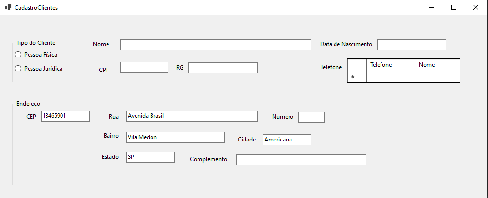

Sistema de locação de materiais para festas, desenvolvido em **C# WinForms** com **Entity Framework Core + MySQL**.

---

## Funcionalidades

- Cadastro de clientes (Pessoa Física e Jurídica)
- Controle de estoque por data
- Criação de contratos e reservas
- Relatórios e consultas
- [Adicione mais funcionalidades conforme necessário]

---

### CadastroCliente
**Descrição:**  
Tela para cadastro de clientes, alterando os dados de cadastro de pessoa fisica para pessoa juridica atravez de RadioButton

**Print do Form:**  

---

### FormPedido
**Descrição:**  
Tela para criação de contratos de locação com as informações do cliente pré-cadastrado que está locando os itens
Data da locação para controle dinamico de estoque com verificação de disponibilidade baseado na data da locação

**Print do Form:**  

---

### Cadastro de Produtos
**Descrição:**  
Tela para cadastro de produtos com informações uteis para controle financeiro e logistico

**Prints:**  

---

## 🛠️ Tecnologias Utilizadas
- C# (.NET 8 / WinForms)
- Entity Framework Core
- MySQL
- GitHub

---

