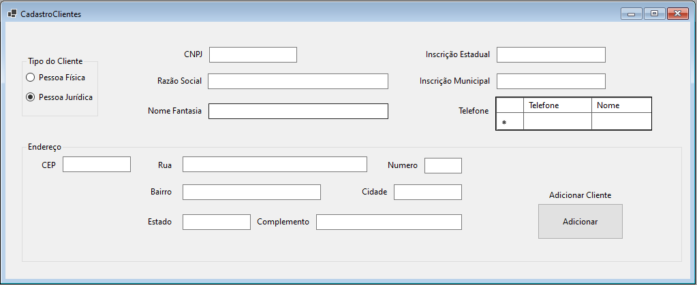

Sistema de locação de materiais para festas, desenvolvido em **C# WinForms** com **Entity Framework Core + MySQL**.

---

## Funcionalidades

- Cadastro de clientes (Pessoa Física e Jurídica)
- Controle dinamico de estoque por data
- Criação de contratos e reservas
- Relatórios e consultas com filtro por data
- Gerenciamento financeiro com retorno de: clientes atendidos, produtos mais alugados, balanço mensal (Em desenvolvimento futuro)

---
### Tela Principal
**Descrição:**
Tela principal do programa aonde são localizadas todas as outras paginas lateralmente a esquerda.
No canto superior direito vai o logo do usuario do sistema e centralizado ao fundo da tela o logo da empresa que desenvolveu

---
### Tela do Pedido
**Descrição:**  
Tela para criação de contratos de locação com as informações do cliente pré-cadastrado que está locando os itens
Data da locação para controle dinamico de estoque com verificação de disponibilidade baseado na data da locação

 

---

### Tela para Filtrar Pedidos
**Descrição**
Tela para realizar a filtragem dos pedidos já efetuados e lançados no banco com dois parametros de datas para controle e gestão de estoque

---

### Cadastro de Cliente
**Descrição:**  
Tela para cadastro de clientes, alterando os dados de cadastro de pessoa fisica para pessoa juridica atravez de RadioButton

 

---

### Filtro de Clientes
**Descrição**
Tela para Filtragem de clientes previamente cadastrados na empresa tanto pessoa fisica quanto empresas(CNPJ)

---

### Cadastro de Produtos
**Descrição:**  
Tela para cadastro de produtos com informações uteis para controle financeiro e logistico

  

---
### Filtro de Produtos
**Descrição**
Tela para Filtragem e alteração de produtos já previamente cadastrados no sistema

---

## 🛠️ Tecnologias Utilizadas
- C# (.NET 8 / WinForms)
- Entity Framework Core
- MySQL
- GitHub
-VIACep

---

